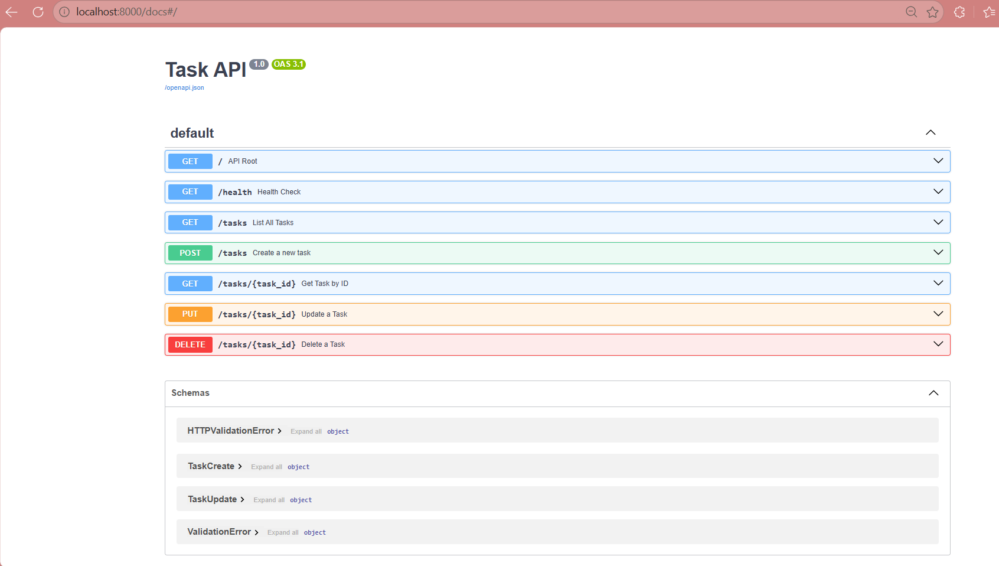

# Task API (Python + FastAPI)

A lightweight RESTful CRUD API built with Python and FastAPI that manages an in-memory to-do list.

## 🚀 Features
* **Full CRUD Operations**: Create, Read, Update, and Delete tasks.
* **Input Validation**: Rejects missing or empty titles using Pydantic models with `400 Bad Request` / `422 Unprocessable Entity`.
* **Standard HTTP Status Codes**: `200` (OK), `201` (Created), `204` (No Content), `400` (Bad Request), `404` (Not Found).
* **Interactive API Docs**: Built-in Swagger UI at `/docs`.

---

## 🛠️ Installation & Setup

1. **Clone the repository:**
   ```bash
   git clone https://github.com/shivii-mallya/CRUD_API_PROJECT.git
   cd CRUD-API-Project
   ```

2. **Create and activate a virtual environment:**
   ```powershell
   python -m venv .venv
   .\.venv\Scripts\Activate.ps1
   ```

3. **Install dependencies:**
   ```bash
   pip install -r requirements.txt
   ```

4. **Run the server:**
   ```bash
   uvicorn main:app --reload --port 8000
   ```

5. **Access the API:**
   * Root: `http://localhost:8000/`
   * Swagger Docs: `http://localhost:8000/docs`

---

## 📌 API Endpoints

| Method | Endpoint | Description | Status Code (Success) |
| :--- | :--- | :--- | :--- |
| `GET` | `/` | API Metadata | `200 OK` |
| `GET` | `/health` | Server Health Check | `200 OK` |
| `GET` | `/tasks` | Get all tasks | `200 OK` |
| `GET` | `/tasks/{id}` | Get task by ID | `200 OK` |
| `POST` | `/tasks` | Create a new task | `201 Created` |
| `PUT` | `/tasks/{id}` | Update task title/status | `200 OK` |
| `DELETE` | `/tasks/{id}` | Delete task by ID | `204 No Content` |

---

## 🧪 Sample `curl` Output

**Request (Create Task):**
```powershell
curl.exe -i -X POST http://localhost:8000/tasks -H "Content-Type: application/json" -d "{\"title\": \"Buy milk\"}"
```

**Response (`201 Created`):**
```http
HTTP/1.1 201 Created
date: Tue, 11 Aug 2026 13:40:00 GMT
server: uvicorn
content-length: 37
content-type: application/json

{"id":4,"title":"Buy milk","done":false}
```

---

## 📸 Swagger UI Screenshot

